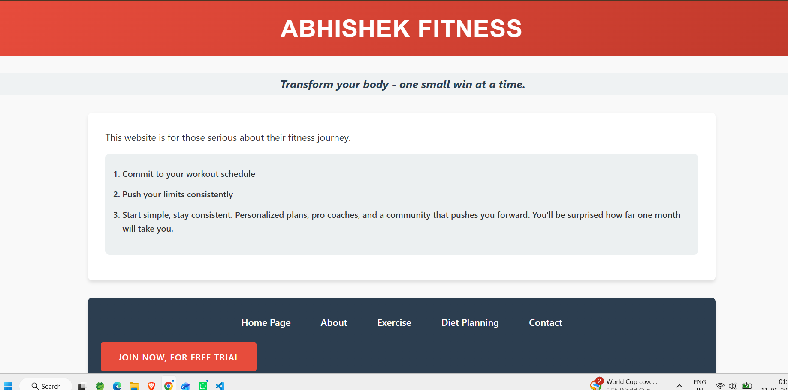
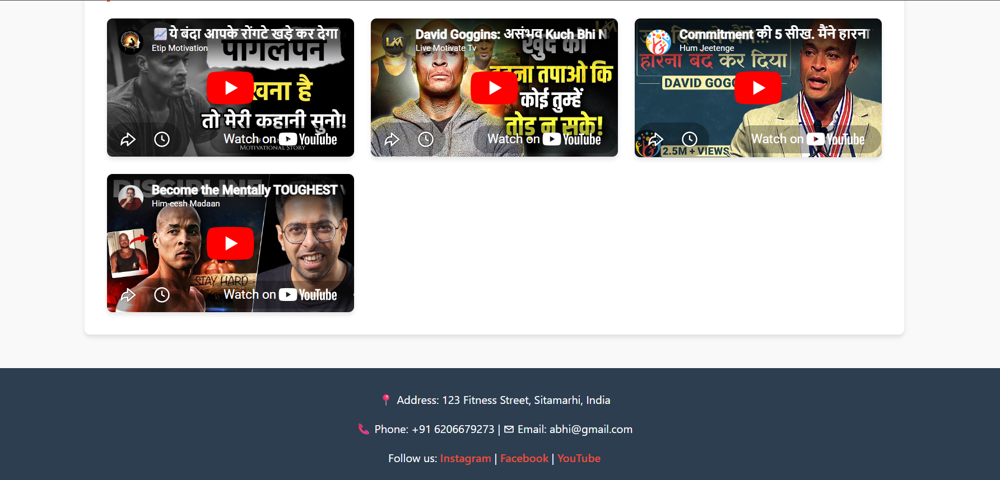
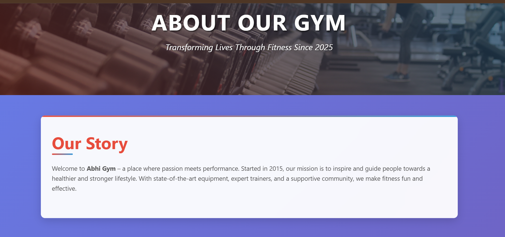
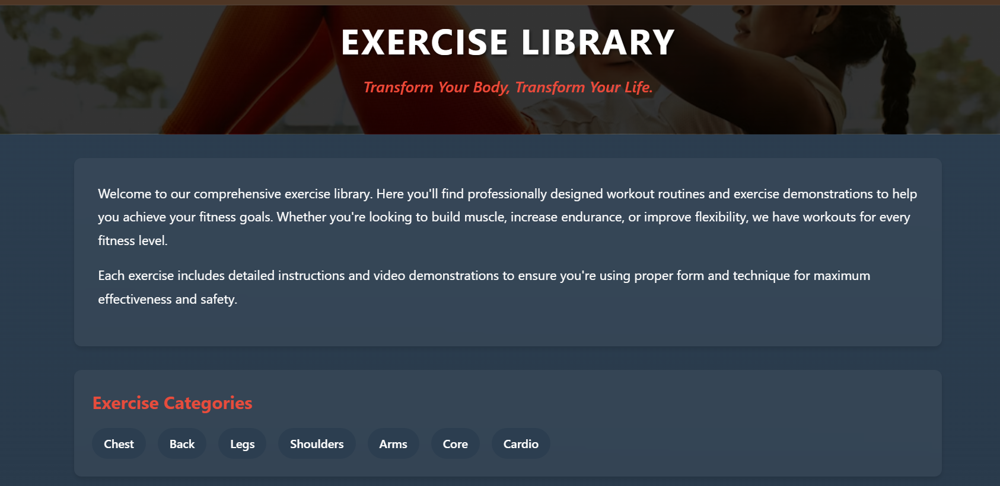

## 🌐 Live Preview

Coming Soon...

## 📸 Project Preview

<p align="center">
  
</p>


# 💪 Abhishek Fitness

<p align="center">
  
  
  
</p>

<p align="center">
  <strong>Transform Your Body – One Small Win at a Time 💪</strong>
</p>

<p align="center">
 Abhishek Fitness is a fitness guidance website built with HTML, CSS, and JavaScript. It provides information about gym workouts, cardio exercises, fitness tips, and motivational videos to help users stay consistent on their fitness journey.
</p>

---

## 📖 Table of Contents

- About the Project
- Features
- Technologies Used
- Project Structure
- Screenshots
- Installation
- Usage
- Future Enhancements
- Contributing
- Author
- License

---

# 🏋️ About the Project

**Abhishek Fitness** is a responsive fitness website developed using **HTML, CSS, and JavaScript**. The website is designed to guide users on their fitness journey by providing useful information about gym workouts, exercise categories, cardio routines, and healthy lifestyle practices.

To make learning easier and more engaging, the platform also includes **motivational fitness videos** that help users stay inspired and committed to their goals.

Whether you are a beginner or an experienced fitness enthusiast, Abhishek Fitness provides valuable resources to support your transformation journey.

---

# ✨ Features

✅ Responsive Fitness Website

✅ Gym Workout Guidance

✅ Exercise Library with Categories

✅ Cardio & Fitness Information

✅ Motivational Fitness Videos

✅ Easy Navigation Between Pages

✅ About Gym Section

✅ Contact Information Section

✅ Modern User Interface

---

# 🛠 Technologies Used

| Technology | Purpose |
|------------|----------|
| HTML5 | Website Structure |
| CSS3 | Styling & Responsive Design |
| JavaScript | Interactive Features |
| YouTube Embed API | Fitness Video Integration |

---

# 📂 Project Structure

```text
Gym-Website/
│
├── index.html
├── about.html
├── exercise.html
├── contact.html
│
├── css/
│   └── style.css
│
├── js/
│   └── script.js
│
├── images/
│   ├── gym-banner.jpg
│   ├── workout.jpg
│   └── fitness.jpg
│
├── screenshots/
│   ├── home-page.png
│   ├── motivation-videos.png
│   ├── about-page.png
│   └── exercise-library.png
│
└── README.md
```

---

# 📸 Screenshots

## 🏠 Home Page


The landing page introduces visitors to the fitness platform and encourages users to stay committed to their workout goals.

---

## 🎥 Motivation Videos Section



A collection of motivational fitness videos to inspire users and help them stay focused on their fitness journey.

---

## 🏋️ About Our Gym



Provides information about the gym, its mission, and its commitment to helping people achieve a healthier lifestyle.

---

## 💪 Exercise Library



Contains workout categories such as Chest, Back, Legs, Shoulders, Arms, Core, and Cardio along with fitness guidance.

---

# 🚀 Installation

## Clone the Repository

```bash
git clone https://github.com/Abhishek-web-git/Gym-Website.git
```

## Navigate to the Project Folder

```bash
cd Gym-Website
```

## Run the Project

Simply open the `index.html` file in your preferred web browser.

No additional installation or dependencies are required.

---

# 💻 Usage

1. Open the website.
2. Navigate through Home, About, Exercise, Diet Planning, and Contact sections.
3. Read fitness guidance and workout information.
4. Explore exercise categories based on muscle groups.
5. Watch motivational fitness videos.
6. Follow the tips and stay consistent with your fitness goals.

---

# 🎯 Future Enhancements

- 🔹 BMI Calculator
- 🔹 Diet Recommendation System
- 🔹 Workout Tracking Feature
- 🔹 User Authentication
- 🔹 Dark Mode
- 🔹 Personalized Fitness Plans
- 🔹 More Exercise Categories
- 🔹 Advanced Responsive Design

---

# 🤝 Contributing

Contributions are welcome!

### Steps to Contribute

1. Fork the repository

2. Create a new branch

```bash
git checkout -b feature-name
```

3. Commit your changes

```bash
git commit -m "Added new feature"
```

4. Push your branch

```bash
git push origin feature-name
```

5. Create a Pull Request

---

# 👨‍💻 Author

**Abhishek Kumar**

🎓 B.Tech Computer Science Student

💻 Aspiring Full Stack Developer

🏋️ Fitness Enthusiast

📍 India

GitHub: https://github.com/Abhishek-web-git

---

# 📄 License

This project is licensed under the MIT License.

You are free to use, modify, and distribute this project for educational and personal purposes.

---

## ⭐ Support

If you found this project useful:

⭐ Star this repository

🍴 Fork this repository

📢 Share it with others

💪 Keep Learning & Keep Growing!

---

<p align="center">
  Made with ❤️ by Abhishek Kumar
</p>
